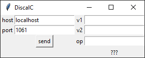

# Discal

Discal is a distributed calculator coded in python using only sockets. It's a project for my Distributed Systems class.

## Project requirements

...

## How it works

...

## How to use

**IMPORTANT:** Before anything, install [psutil](https://pypi.org/project/psutil/) and [tkinter](https://docs.python.org/3/library/tkinter.html) with `pip install -r dependencies.txt`

You have to run [client.py](./client.py), [server.py](./server.py) and [balancer.py](./balancer.py). balancer.py must be run after server.py.

### Running the load balancer

Before running the load balancer, you should configuree what server instances you want it to connect to. That is done via editing the variable `SERVERS` in balancer.py.

The actual host and port it's going to serve are arguments from the command-line

```
$ python balancer.py {host} {port}
```

### Running the server

```
$ python server.py {host} {calculator_port} {cpu_usage_port}
```

### Client

Simply run:
```
$ python client.py
```

It's really simple to use the client application. You just place the load balancer host and port, then the values v1, v2 and op (+, -, * or /). After that, just hit **send** and you should see the result on top of the **???**.


